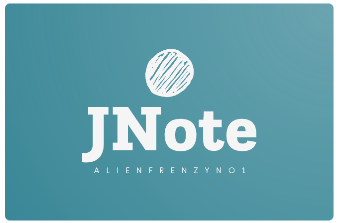

<!-- Improved compatibility of back to top link: See: https://github.com/othneildrew/Best-README-Template/pull/73 -->
<a name="readme-top"></a>
<!--
*** Thanks for checking out the Best-README-Template. If you have a suggestion
*** that would make this better, please fork the repo and create a pull request
*** or simply open an issue with the tag "enhancement".
*** Don't forget to give the project a star!
*** Thanks again! Now go create something AMAZING! :D
-->

<!-- PROJECT LOGO -->
<br />
<div align="center">
  <a href="https://github.com/alienfrenZyNo1/code-documenter">
    
  </a>

  <h3 align="center">jnote-alienfrenzyno1</h3>

  <p align="center">
    Udemy course project 
    <br />
    <a href="https://www.udemy.com/course/react-and-typescript-build-a-portfolio-project"><strong>Explore on Udemy</strong></a>
    <br />
    <br />
  </p>
</div>


<!-- TABLE OF CONTENTS -->
<details>
  <summary>Table of Contents</summary>
  <ol>
    <li>
      <a href="#about-the-project">About The Project</a>
    </li>
    <li>
      <a href="#getting-started">Getting Started</a>
    </li>
    <li><a href="#contact">Contact</a></li>
    <li><a href="#acknowledgments">Acknowledgments</a></li>
  </ol>
</details>


<!-- ABOUT THE PROJECT -->
## About The Project

This project was built following along to Steven Grider's Udemy course - React and Typescript build a portfolio project.

Note worthy design choices:
* Separate project into npm packages to make adding features in the future easier
* The use of ESBuild Lerna


<p align="right">(<a href="#readme-top">back to top</a>)</p>


<!-- GETTING STARTED -->
## Getting Started

* Just type below into your terminal
  ```
  npx jsnote-alienfrenzyno1 serve
  ```


<p align="right">(<a href="#readme-top">back to top</a>)</p>


<!-- CONTACT -->
## Contact

Adrian Marikar - [@your_LinkedIn](https://www.linkedin.com/in/adrianmarikar/) - adrianmarikar@gmail.com

Project Link: [https://github.com/alienfrenZyNo1/code-documenter](https://github.com/alienfrenZyNo1/code-documenter)

<p align="right">(<a href="#readme-top">back to top</a>)</p>


<!-- ACKNOWLEDGMENTS -->
## Acknowledgments

* [React and Typescript: Build a Portfolio Project](https://www.udemy.com/course/react-and-typescript-build-a-portfolio-project)


<p align="right">(<a href="#readme-top">back to top</a>)</p>
